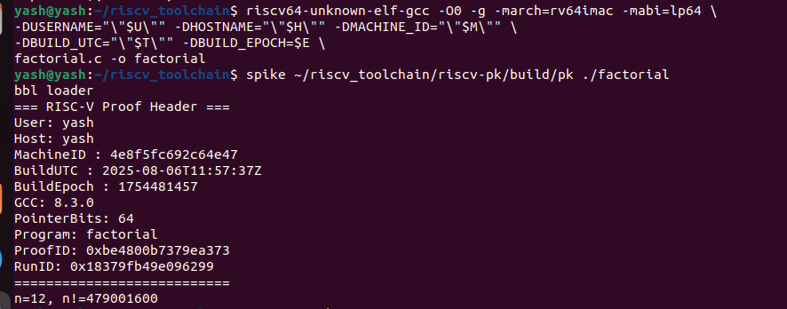
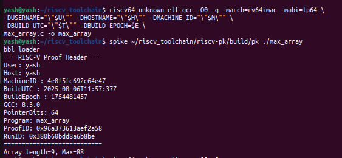
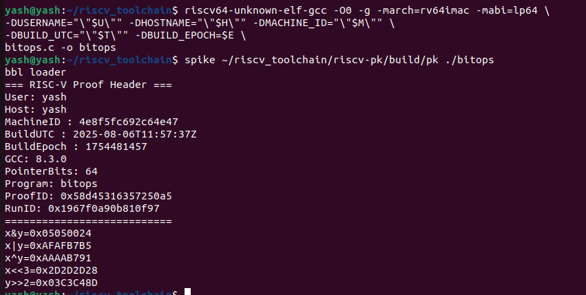
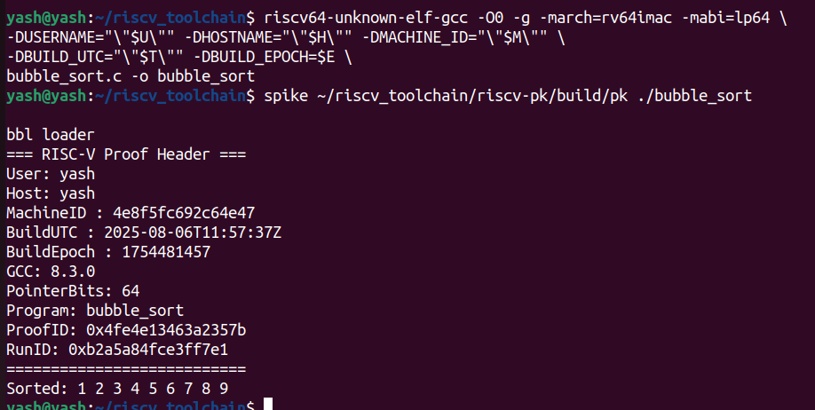
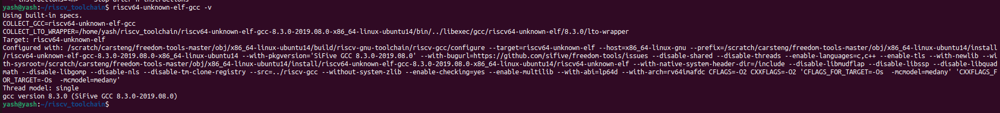

# 🚀 Task 2: RISC-V Local Setup, Compilation & Instruction Decoding

This repository documents the complete workflow for **Task 2**, including:

- Setting up local metadata in RISC-V programs
- Compiling with the toolchain
- Disassembling and decoding instructions
- Validating output through **Spike**


---

##  Table of Contents

- [TASK-2.1 — Environment Setup](#task-21--environment-setup)
- [TASK-2.2 — Adding unique.h](#task-22--adding-uniqueh)
- [TASK-2.3 — Creating C Source Files](#task-23--creating-c-source-files)
  - [2.3.1 — factorial.c](#231--factorialc)
  - [2.3.2 — max_array.c](#232--max_arrayc)
  - [2.3.3 — bitops.c](#233--bitopsc)
  - [2.3.4 — bubble_sort.c](#234--bubble_sortc)
- [TASK-2.4 — Compiling Programs](#task-24--compiling-programs)
- [TASK-2.5 — Running with Spike](#task-25--running-with-spike)
- [TASK-2.6 — Generating Assembly](#task-26--generating-assembly)
- [TASK-2.7 — Extracting Disassembly of main](#task-27--extracting-disassembly-of-main)
- [TASK-2.8 — Output Screenshots](#task-28--output-screenshots)
- [TASK-2.9 — Instruction Decoding](#task-29--instruction-decoding)
- [TASK-2.10 — Tool Version Checks](#task-210--tool-version-checks)

---

## TASK-2.1 — Environment Setup

Run the following in your terminal before compilation:

```bash
export U=$(id -un)
export H=$(hostname -s)
export M=$(cat /etc/machine-id | head -c 16)
export T=$(date -u +%Y-%m-%dT%H:%M:%SZ)
export E=$(date +%s)
```

---

## TASK-2.2 — Adding `unique.h`


#ifndef UNIQUE_H
#define UNIQUE_H
#include <stdio.h>
#include <stdint.h>
#include <time.h>

#ifndef USERNAME
#define USERNAME "unknown_user"
#endif
#ifndef HOSTNAME
#define HOSTNAME "unknown_host"
#endif
#ifndef MACHINE_ID
#define MACHINE_ID "unknown_machine"
#endif
#ifndef BUILD_UTC
#define BUILD_UTC "unknown_time"
#endif
#ifndef BUILD_EPOCH
#define BUILD_EPOCH 0
#endif

static uint64_t fnv1a64(const char *s) {
const uint64_t OFF = 1469598103934665603ULL, PRIME = 1099511628211ULL;
uint64_t h = OFF;
for (const unsigned char *p=(const unsigned char*)s; *p; ++p) {
h ^= *p; h *= PRIME;
}
return h;
}
static void uniq_print_header(const char *program_name) {
time_t now = time(NULL);
char buf[512];
int n = snprintf(buf, sizeof(buf), "%s|%s|%s|%s|%ld|%s|%s",
USERNAME, HOSTNAME, MACHINE_ID, BUILD_UTC,
(long)BUILD_EPOCH, __VERSION__, program_name);
(void)n;
uint64_t proof = fnv1a64(buf);
char rbuf[600];
snprintf(rbuf, sizeof(rbuf), "%s|run_epoch=%ld", buf, (long)now);
uint64_t runid = fnv1a64(rbuf);
printf("=== RISC-V Proof Header ===\n");
printf("User: %s\n", USERNAME);
printf("Host: %s\n", HOSTNAME);
printf("MachineID : %s\n", MACHINE_ID);
printf("BuildUTC : %s\n", BUILD_UTC);
printf("BuildEpoch : %ld\n", (long)BUILD_EPOCH);
printf("GCC: %s\n", __VERSION__);
printf("PointerBits: %d\n", (int)(8*(int)sizeof(void*)));
printf("Program: %s\n", program_name);
printf("ProofID: 0x%016llx\n", (unsigned long long)proof);
printf("RunID: 0x%016llx\n", (unsigned long long)runid);
printf("===========================\n");
}
#endif


---

## TASK-2.3 — Creating C Source Files


### 2.3.1 — factorial.c
```bash
#include "unique.h"
static unsigned long long fact(unsigned n){ return (n<2)?1ULL:n*fact(n-1); }
int main(void){
	uniq_print_header("factorial");
	unsigned n = 12;
	printf("n=%u, n!=%llu\n", n, fact(n));
	return 0;
}
```

### 2.3.2 — max_array.c

```bash
#include "unique.h"
int main(void){
	uniq_print_header("max_array");
	int a[] = {42,-7,19,88,3,88,5,-100,37};
	int n = sizeof(a)/sizeof(a[0]), max=a[0];
	for(int i=1;i<n;i++) if(a[i]>max) max=a[i];
	printf("Array length=%d, Max=%d\n", n, max);
	return 0;
}
```

### 2.3.3 — bitops.c

```bash
#include "unique.h"
int main(void){
	uniq_print_header("bitops");
	unsigned x=0xA5A5A5A5u, y=0x0F0F1234u;
	printf("x&y=0x%08X\n", x&y);
	printf("x|y=0x%08X\n", x|y);
	printf("x^y=0x%08X\n", x^y);
	printf("x<<3=0x%08X\n", x<<3);
	printf("y>>2=0x%08X\n", y>>2);
	return 0;
}
```

### 2.3.4 — bubble_sort.c

```bash
#include "unique.h"
void bubble(int *a,int n){ for(int i=0;i<n-1;i++) for(int j=0;j<n-1-i;j++) if(a[j]>a[j+1]){int t=a[j];a[j]=a[j+1];a[j+1]=t;} }
int main(void){
	uniq_print_header("bubble_sort");
	int a[]={9,4,1,7,3,8,2,6,5}, n=sizeof(a)/sizeof(a[0]);
	bubble(a,n);
	printf("Sorted:"); for(int i=0;i<n;i++) printf(" %d",a[i]); puts("");
	return 0;
}
```

## TASK-2.4 — Compiling Programs

Use the following command for each file, replacing `<program>`:

```bash
riscv64-unknown-elf-gcc -O0 -g -march=rv64imac -mabi=lp64 \
-DUSERNAME="\"$U\"" -DHOSTNAME="\"$H\"" -DMACHINE_ID="\"$M\"" \
-DBUILD_UTC="\"$T\"" -DBUILD_EPOCH=$E \
<program>.c -o <program>
```

---

## TASK-2.5 — Running with Spike

Use the compiled programs with Spike + Proxy Kernel:

```bash
spike ~/riscv_toolchain/riscv-pk/build/pk ./<program>
```

---

## TASK-2.6 — Generating Assembly

```bash
riscv64-unknown-elf-gcc -O0 -S <program>.c -o <program>.s
```

---

## TASK-2.7 — Extracting Disassembly of `main`

```bash
riscv64-unknown-elf-objdump -d ./<program> | sed -n '/<main>:/,/^$/p' > <program>_main_objdump.txt
```

---

## TASK-2.8 — Output Screenshots

## TASK-2.8.1 - factorial


## TASK-2.8.1 - max_array


## TASK-2.8.1 - bitops


## TASK-2.8.4 - bubble_sort


---

## TASK-2.9 — Instruction Decoding


| Instr | Opcode | rd | rs1 | rs2 | funct3 | funct7 | Binary | Description |
|-------|--------|----|-----|-----|--------|--------|--------|-------------|
| add x5,x6,x7 | 0110011 | x5 | x6 | x7 | 000 | 0000000 | 00000000011100110000001010110011 | x5 = x6 + x7 |

---

## TASK-2.10 — Tool Version Checks

## TASK-2.10.1 - verifying spike version


## TASK-2.10.2 - verifying gcc version



---

